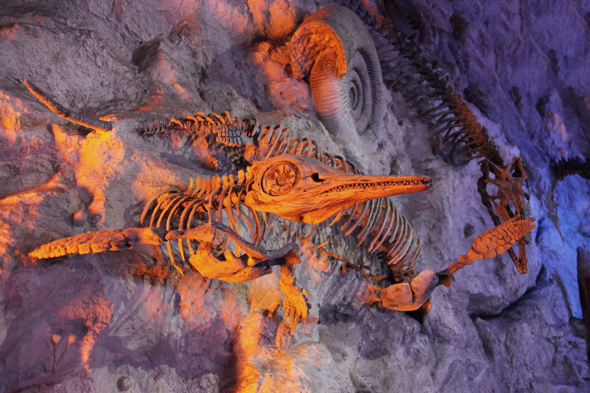

# Project4

# Data
For this clean up, we used the Pandas and Regex libraries. Our data came from [The Paleobiology Database](https://paleobiodb.org/#/). 

## Use Instructions
1. Upload "nnModel_Colab" to Google Colab "https://colab.research.google.com/"
2. Click the files icon on the right side of the Colab Page
3. Click "Upload to session storage"
4. Upload "cleaned_data_revisedSet_noNull2" from this repository in the "Starting_Data" Folder
5. Click on runtime on the top left of screen
6. From the runtime dropbox click run all

## Tableau Dashboard Links
1. [Vizualizations for new dataset and breakdown of old and new datasets](https://public.tableau.com/app/profile/mitchell.knight/viz/Project4NewData/Dashboard1?publish=yes)
2. [Learning Model version overview](https://public.tableau.com/app/profile/mitchell.knight/viz/ModelStatsProject4/Dashboard1)

## Accessing Data
This project worked with two datasets.
1. Contained instances of Therapoda and Thyreophora fossils found in North America.
2. The second dataset is much wider. This data was global and the two clades compared (Ornithischia and Saurischia) were broader
3. We utilized variables from this data including geospatial data, lithology, paleoenvironmental classificaion, estimated age of geological strata and the corresponding geologic time period.
   
## Data Clean Up
Once converted from CSV to dataframe, the data was explored, and reduced from thirty-one to seven columns. Columns that were insufficient or wholly incomplete were dropped.\
   Further eccentricities found in the environment column were scrubbed using the regex library.

## Summary
The model formats explored in this project have been optimized to run with our final dataset.

   
# Encoding Models
The majority of our features are lithology and environment. 
## Label Encoding
Label_Encoded technique was used over hot encoder because it had a higher acurracy, it reach 91 percent%
## OneHot Encoding
This methods converts series into instances by column. Each column is a series of booleans.

## Analysis

# Machine learning models
## Neural Network
This is the model we decided to work with. It allowed us to tweak the process, manipulating layers and nodes over several versions. 

## Logistic Regression
This model is useful for binary classification. However the issue with this model was in its ability to learn from an imbalanced dataset. For instance, the first few runs (wherein Therapoda is overrepresented) many Thyreophora were misidentified.

## Decision tree
The most accurate instance of this model contained both lithologic and environmental data. 
Included was longitudinal data, this furthered the models accuracy by ~ 4% t 73.44% where the previous model ignored latitude and longitude, yielding 69.02%.

