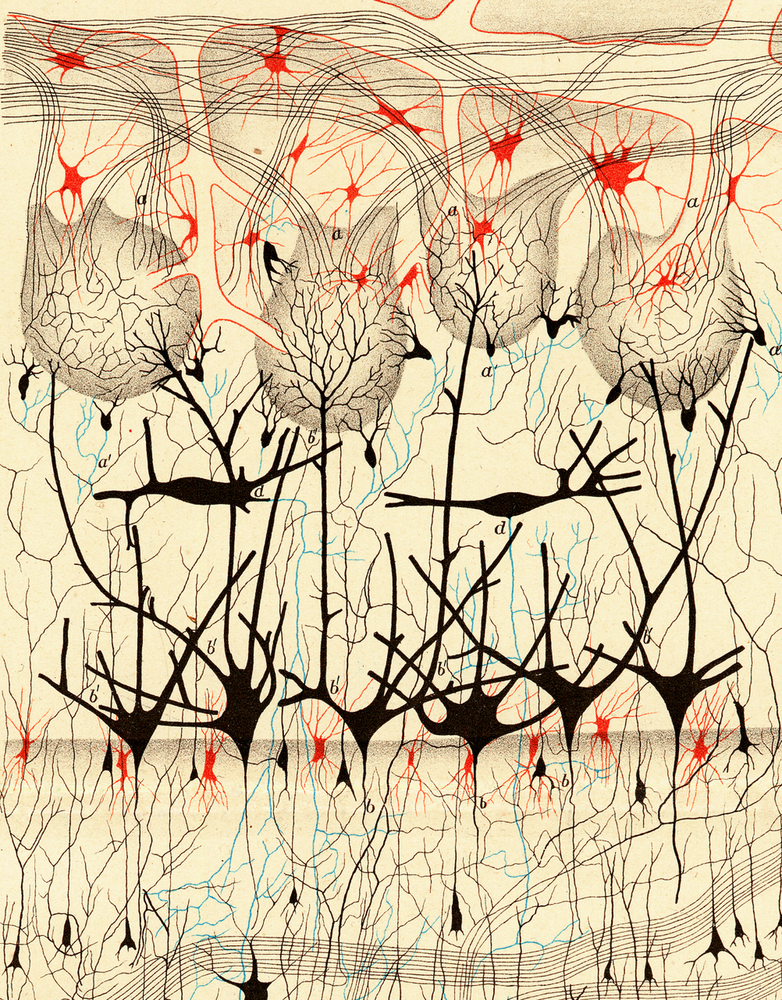

# Project4

description goes here

# Data
For this clean up, we used the Pandas and Regex libraries. Our data came from [The Paleobiology Database](https://paleobiodb.org/#/). 

## Use Instructions
1. Upload "nnModel_Colab" to Google Colab "https://colab.research.google.com/"
2. Click the files icon on the right side of the Colab Page
3. Click "Upload to session storage"
4. Upload "cleaned_data_revisedSet_noNull2" from this repository in the "Starting_Data" Folder
5. Click on runtime on the top left of screen
6. From the runtime dropbox click run all

## Tableau Dashboard Links
1. Vizualizations for new dataset and breakdown of old and new datasets: https://public.tableau.com/app/profile/mitchell.knight/viz/Project4NewData/Dashboard1?publish=yes
2. Learning Model version overview: https://public.tableau.com/app/profile/mitchell.knight/viz/ModelStatsProject4/Dashboard1 

## Accessing Data
This project worked with two datasets.
1. Describe which columns and setting swere used to filter data.
2. This data was global. 
   
## Data Clean Up
Once converted from CSV to dataframe, the data was explored, and reduced from thirty-one to seven columns. Columns that were insufficient or wholly incomplete were dropped.\
   Further eccentricities found in the environment column were scrubbed using the regex library.

## Summary
The model formats explored in this project have been optimized to run with our final dataset.

   
# Encoding Models
The majority of our features are lithology and environment. 
## Label Encoding
Label_Encoded technique was used over hot encoder because it had a higher acurracy, it reach 91 percent%
## OneHot Encoding
This methods converts series into instances by column. Each column is a series of booleans.

## Analysis

# Machine learning models
## Logistic Regression

## Decision tree
Has potential
The most accurate instance of this model contained both lithologic and environmental data. Included was longitudinal data, this furthered the models accuracy by ~ 4% t 73.44% where the previous model ignored latitude and longitude, yielding 69.02%.

## Neural Network
The most promising technique

## Analysis

# Errors made along the way
- Imbalanced Data
- 

